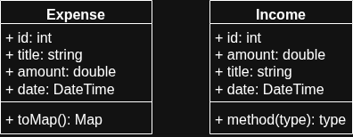

# Simple Expense Tracking App

This Android app offers a simple and easy manner of track your expenses and incomes. An internet connection is not necessary because all the data is stored locally. So you can add an expense or income at any time, for example, on the bus, in a supermarket or even being a forest.

This app is recommended for students, housewives and people who has a rapid life style and want to manage and track their money.

## Table of Contents

- [Project planning](#project-planning)
    - [Available features](#available-features)
    - [Upcoming features](#upcoming-features)
- [Installation](#installation)
- [Usage](#usage)
- [Development process](#development-process)
    - [Design](#design)
    - [Coding](#implementation)
    - [Testing](#testing)
- [License](#license)

## Project planning

### Available features
- Expenses management:
  - Add expense
  - Remove expense
- Incomes management:
  - Add income
- Watch the overall spent money

### Upcoming features
1. Search and filter transactions (incomes/expenses)
2. Delete income
3. Update expense
4. Update incomes.
5. Show statistics about financial activity
6. Create custom tags/categories for expenses and incomes
7. Schedule recurring transactions
8. Dark mode support
9. Cloud backup support
10. Export financial activity report to PDF
11. Internationalized UI for spanish language

## Installation
The following instructions show how to install the project in your computer in order to analyze it, test it or even add new features.

1. Get dependencies
    ```bash
    flutter pub get 
    ```
2. Build and run the app on the configured android device
    ```bash
    flutter run -d <device name>
    ```

## Usage

*Section Available after releasing the first version*.

## Development process
This section contains relevant information about the analysis, design decisions, key elements, coding practices and testing planning.

### Design

#### Data modeling
Ths following diagram shows the domain classes used to store and transport data through the application.



#### Architecture
This app is based on **MVVM** architecture:
- **Model**: repository classes that retrieve and store data (the source of truth).
- **View**: UI made with flutter widgets. Views are 'listeners' that re-render their widgets tree every time the model is manipulated.
- **View-Model**: classes that bind the Model and View. It protects the model from being accessed directly by the View and ensures that data flow starts from a change to the model.

The project follows the next folders structure:
```
lib
├─┬─ ui
│ ├─┬─ shared
│ │ └─── <shared widgets>
│ ├─── theme
│ └─┬─ <FEATURE NAME>
│   ├─── <view_model class>.dart
│   └─── <feature name>_screen.dart
├─┬─ domain_models
│ └─── <model name>.dart
├─┬─ data
│ ├─┬─ repositories
│ │ └─── <repository class>.dart
│ └─── local_db.dart
├─── config
├─┬─ utils
│ └─── constants.dart
├─── routing
└─── main.dart

test
├─── data
└─── ui
```

### Implementation
The project follows the coding standards of flutter applications.

#### Libraries
| Library        | Purpose                                        |
|----------------|------------------------------------------------|
| **sqflite**    | Implement data persistence locally with SQLite |
| **path**       | Manipulate paths                               |
| **provider**   | Manage dependency injection                    |
| **go_router**  | Manage the UI routing and navigation           |
| **intl**       | Format data, such as dates and times           |
| **command_it** | Implement the command pattern in the UI layer  |
| **logging**    | Add logging through the application layers     |

### Testing
*Testing planning upcoming*

## License
This project is licensed under the MIT License.